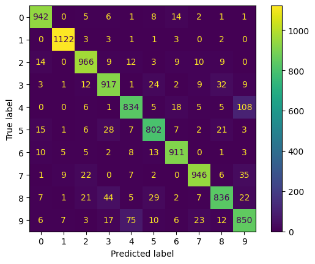

# MNIST Handwritten Digit Recognizer

A machine learning project that uses **Principal Component Analysis (PCA)** for dimensionality reduction and a **Random Forest Classifier** to recognize handwritten digits from the MNIST dataset.
---
## Overview
The MNIST dataset contains 70,000 grayscale images of handwritten digits (0–9), each of size 28x28 pixels. This project demonstrates how to:
1. Load and preprocess the data (flattening images and splitting into train/test sets).
2. Apply **PCA** to reduce the dimensionality of the feature space.
3. Train a **Random Forest Classifier** on the transformed data.
4. Evaluate the performance of the model.

        +-----------------------+       +-----------------------+
        | MNIST Data (28x28)   |       | Random Forest         |
        +-----------------------+       +-----------+-----------+
                    |                               ^
                    v                               |
             +--------------+                       |
             |  PCA (dim)   |                       |
             |    reduce    |-----------------------+
             +--------------+
*(Above: High-level flow of the pipeline.)*
---
## Data
The MNIST dataset was from  machine learning libraries ( `sklearn.datasets`) but can also  be downloaded from [MNIST Official Website](https://www.kaggle.com/datasets/scolianni/mnistasjpg?resource=download) 
 Typically, it is loaded with:
```python
from sklearn.datasets import fetch_openml

mnist = fetch_openml('mnist_784', version=1)
X, y = mnist.data, mnist.target
```

--
---
 ## Prerequisites & Installation
 1. Clone the repository
 2. Create and activate a virtual environment (optional but recommended
 3. Install dependencies
 ---
## Results
Once the model is trained, you can evaluate its performance using metrics like accuracy, precision, recall,
Digit Predicted →  0    1    2    ...   9


---
## License
This project is licensed under the MIT License. Feel free to use and modify the code in your own projects.
---